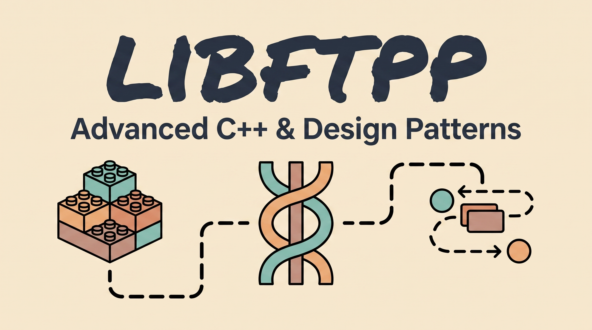

This is a school project for 42 focused on exploring advanced C++ concepts. The goal is to build a library of reusable components that can be carried over into future projects. Throughout the project, we implement standard design patterns—like Singleton, Observer, and Command—to better understand how larger software architectures are structured. It also covers multi-threading through the creation of thread-safe data structures, and introduces basic networking by building a simple client and server.

## Getting Started

To test the library and see the components in action, you first need to clone the repository:

```bash
git clone git@github.com:multitudes/libftpp.git
cd libftpp

```

To compile the source code and generate the static library archive (`libftpp.a`), simply run:

```bash
make

```

To compile and run the test suite (which links `main.cpp` and `test.cpp` against the library and automatically executes the binary), run:

```bash
make test

```

*(Note: You can also use `make clean` to remove the object files, or `make fclean` to completely remove the object files, the test executable, and the `.a` archive.)*

---

## Data Structures

Here we tackle memory management and data serialization. I built an Object Pool to pre-allocate memory and reuse objects without the heavy performance hit of constantly calling `new` and `delete` at runtime. I also implemented a `DataBuffer` class that acts like a binary stream, using C++ operator overloading to neatly convert variables into raw bytes for storage or network transmission.

See more in the [Data Structures Readme](./readmes/datastructures.md)

## Design Patterns

This section explores modern implementations of classic software architecture patterns from the famous 1994 "Gang of Four" book. Instead of relying on rigid, old-school inheritance trees, I adapted these for modern C++. You will find a completely decoupled Publish/Subscribe Event Bus (Observer), a State Machine to handle behaviors cleanly, a Snapshot system (Memento), and a generic Singleton template.

See more in the [Design Patterns Readme](./readmes/designpatterns.md)

## IOStream

Printing to the console from multiple threads usually results in a scrambled mess of overlapping text. To fix this, I built a thread-safe wrapper around `std::cout`. It uses `thread_local` storage to give every thread its own private waiting room, and only locks the global console to print the entire block at once when it catches a `std::endl` manipulator.

See more in the [IOStream Readme](./readmes/iostream.md)

## Thread

Spawning OS threads on the fly is computationally expensive. To handle asynchronous tasks efficiently, I built a custom `Thread` wrapper and a `WorkerPool`. Instead of creating and destroying threads on demand, the pool "hires" a fixed number of sleeping workers at startup. When a job arrives, a worker wakes up, executes it via a thread-safe queue, and goes right back to sleep.

See more in the [Thread Readme](./readmes/thread.md)

## Network

This module introduces basic networking by building a multi-threaded client and server. I created a `Message` class that tags payloads and uses overloaded `<<` and `>>` operators to easily push and pull data. The architecture relies on background listener threads to constantly receive incoming messages without freezing or blocking the main application loop.

See more in the [Network Readme](./readmes/network.md)

## Mathematics

This covers the foundational math tools needed for a game engine or procedural simulation. It includes templated 2D and 3D vector classes with overloaded operators for natural mathematical syntax. I also implemented a deterministic pseudo-random coordinate generator using a stateless spatial hash function (based on MurmurHash3's avalanche effect) to generate consistent, seed-based noise.

See more in the [Mathematics Readme](./readmes/mathematics.md)

## PerlinNoise2D

Invented by Ken Perlin (originally to generate realistic textures for the 1982 movie *Tron*), Perlin noise is a way to generate natural-looking randomness. I implemented this to create smooth, continuous noise, which is the industry standard for procedural generation like terrain, maps, or clouds.

See more in the [Perlin Noise Readme](./readmes/perlin.md)

## Bonuses

For the extra features, I built a PPM image exporter to easily visualize the Perlin noise generator's output. I also implemented a polling `Timer` using C++11's `<chrono>` and `steady_clock` for precise, strictly monotonic timekeeping, alongside a deep dive into building a modern, lambda-based Command Design Pattern queue.

See more in the [Bonuses Readme](./readmes/bonus.md)

## Links and Resources

[https://en.wikipedia.org/wiki/Design_Patterns](https://en.wikipedia.org/wiki/Design_Patterns)

[https://en.wikipedia.org/wiki/Object_pool_pattern](https://en.wikipedia.org/wiki/Object_pool_pattern)

[https://en.wikipedia.org/wiki/Data_buffer](https://en.wikipedia.org/wiki/Data_buffer)

[https://en.wikipedia.org/wiki/Observer_pattern](https://en.wikipedia.org/wiki/Observer_pattern)

[https://en.wikipedia.org/wiki/State_pattern](https://en.wikipedia.org/wiki/State_pattern)

[https://en.wikipedia.org/wiki/Memento_pattern](https://en.wikipedia.org/wiki/Memento_pattern)

[https://en.wikipedia.org/wiki/Command_pattern](https://en.wikipedia.org/wiki/Command_pattern)

[https://en.wikipedia.org/wiki/Singleton_pattern](https://en.wikipedia.org/wiki/Singleton_pattern)
