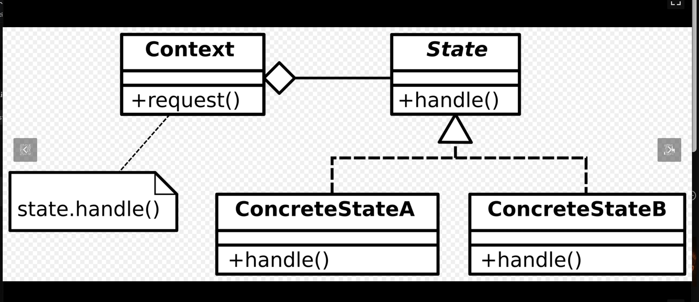

# 42-libftpp

This is a school project for 42 focused on exploring advanced C++ concepts. The goal is to build a library of reusable components that can be carried over into future projects. Throughout the project, we implement standard design patterns—like Singleton, Observer, and Command—to better understand how larger software architectures are structured. It also covers multi-threading through the creation of thread-safe data structures, and introduces basic networking by building a simple client and server.

## Object Pool

> The object pool pattern is a software creational design pattern that uses a set of initialized objects kept ready to use – a "pool" – rather than allocating and destroying them on demand. A client of the pool will request an object from the pool and perform operations on the returned object. When the client has finished, it returns the object to the pool rather than destroying it; this can be done manually or automatically. - Wiki

Object pools are primarily used for performance: in some circumstances, object pools significantly improve performance. Object pools complicate object lifetime, as objects obtained from and returned to a pool are not actually created or destroyed at this time, and thus require care in implementation.
Dynamically allocating (using new) and deallocating (using delete) memory during runtime is computationally expensive.  
A Pool solves this by pre-allocating a large batch (a "pool") of memory for these objects upfront. According to the project requirements the Pool class "manages a collection of reusable templated TType objects". Instead of creating a new object from scratch, we "acquire" an existing, unused chunk of memory from the pool, construct our object there, and when we are done, we give the memory back to the pool to be reused.  
Crucially, when the object is released back to the pool, the subject requires "calling the destructor of the TType object but without deallocating the memory". The memory stays reserved for the next time we need it.  
We will implement these methods:

```cpp
// will be possible to resize the pool only if empty!
void resize(const size_t& numberOfObjectStored):

// Allocates a certain number of TType objects 
// within the memory allocated in the Pool.
template<typename ... TArgs> Pool::Object<TType>
acquire(TArgs&& p_args){...}

// Creates a Pool::Object containing a pre-allocated size for n objects
Pool(size_t size) {}

// overloading the `->` 
// Returns the pointer stored within the Pool::Object.
-TType* operator -> (){...}
```

### Implementing RAII (Resource Acquisition Is Initialization)

Every requests and releases of a pre-allocated objects must be handled by Pool::Object, not by the user. The Pool::Object acts as a custom smart wrapper. When a user requests an object, they get a Pool::Object. When that Pool::Object goes out of scope, its destructor should automatically handle returning the resource to the pool.

`TType` is the type of the final object we are storing in the pool (e.g., a Player, a Bullet, or a std::string).  `TArgs` are the arguments passed into the constructor of `TType`.  

### Variadic Templates and Forwarding References

Variadic Templates are useful to create a function taking any number of arguments.
There are three distinct options all valid:

- Pass by Value (Copies everything)

```cpp
template <typename... Args>
void doSomething(Args... args) { ... } 
// If you pass a massive string here, it makes a full copy of it.
```

- Pass by Const Reference
Safe, no copies, but it completely breaks if the user passes a temporary value (an rvalue). You wouldn't be able to do `pool.acquire(5)`, because you can't bind a standard reference to a raw number.

```cpp
template <typename... Args>
void doSomething(const Args&... args) { ... }
// Great for printing or reading. Nothing is copied, but you can't modify them.
```

- Pass by Forwarding Reference (&&)

```cpp
template <typename... Args>
void doSomething(Args&&... args) { ... }
```

When we attach `&&` to a template parameter, it becomes a "Forwarding Reference" (often called a Universal Reference).

If the user passes a normal variable (`l-value`), the `&&` collapses into a standard reference `&`. If the user passes a temporary variable (like "Hello" or 5), it stays as `&&`.

The `acquire` function only job is to take arguments from the user and hand them *exactly as they are* to the `TType` constructor. When the compiler sees `TArgs&&` in a template, it does "reference collapsing." It looks at what the user actually passed and adapts:

- If the user passes a normal, named variable (an lvalue), `TArgs&&` collapses into a normal reference (`&`).
- If the user passes a temporary value (an rvalue, like a raw `5`), `TArgs&&` remains an rvalue reference (`&&`).

To make this "Perfect Forwarding" actually work inside the function body, we must pair `&&` with a standard library tool called `std::forward`.

```cpp
#include <utility> // Required for std::forward

template <typename... TArgs> 
Object acquire(TArgs&&... p_args) {
    // 1. Find the raw memory address
    void* memory_address = ...

    // 2. Construct the object using placement new and perfect forwarding
    TType* constructed_object = new (memory_address) TType(std::forward<TArgs>(p_args)...);

    // 3. Return the Object wrapper
}
```

By using `TArgs&&` in the parameter list and `std::forward<TArgs>(p_args)...` in the function body, we guarantee that the arguments arrive at the constructor in the exact same state (copyable, movable, const, or non-const) as when the user passed them.

### Using the Operator Overloading `->`

The line `TType *operator->() { return _ptr; }` is what makes the custom `Pool::Object` behave like a real, built-in pointer.  
When `acquire()` returns a `Pool::Object`, the user receives a wrapper, not the raw `Particle*` (or whatever `TType` is).  
If the user wants to call a method on their particle, like `printPosition()`, the compiler will get confused if they just type `myObject->printPosition()`. The compiler sees that `myObject` is a `Pool::Object` class, not a pointer, and it doesn't have a `printPosition()` method inside it.

Without overloading the arrow operator, we would have to force the user to do something ugly and clunky like this:

```cpp
// If we used a normal getter method like getPtr()
myObject.getPtr()->printPosition(); 

```

By defining `TType *operator->()`, we are saying: *"If anyone ever uses the `->` operator directly on my `Pool::Object`, automatically reach inside and give them the raw `_ptr` instead."*

Because of this overload, the user can write code that feels completely natural, exactly as if they were holding a real pointer:

```cpp
// The compiler automatically translates this:
myObject->printPosition();

// Into this under the hood:
myObject.operator->()->printPosition();

```

This technique is exactly how standard library smart pointers (like `std::unique_ptr` and `std::shared_ptr`) work under the hood.

### Using `explicit` for `operator bool()`

In C++, compilers love to automatically convert types (called **implicit conversion**) to try and make the code compile.

If you just write `operator bool() const` without the `explicit` keyword, your object can be secretly treated as a `bool` (which is essentially a `0` or `1`) anywhere in your program. Here is the scenario of what happens without `explicit`:

```cpp
auto myObject = particlePool.acquire("Alpha", 1, 2, 3);

// This is perfectly valid C++ without 'explicit'.
// myObject evaluates to 'true' (1), so mathResult becomes 101.
int mathResult = myObject + 100; 

// Or if a function expects an integer, you could accidentally pass the object!
someFunctionExpectingInt(myObject); 
```

The compiler won't warn; it will just silently convert the custom `Pool::Object` into a `1` and continue running, creating a massive logical bug. By adding `explicit`:

```cpp
explicit operator bool() const { return _ptr != nullptr; }
```

We are telling the compiler: *"You are only allowed to convert this to a boolean in strict, explicit boolean contexts."*  With `explicit`, the bad math code (`myObject + 100`) will immediately throw a compile-time error.

## DataBuffer, a binary serialization buffer

The requirements ask for "storing objects in byte format" and "Use C++ stream operators", it is asking me to build a class that acts like std::cout or std::cin, but instead of printing text to a screen, it converts variables into raw binary bytes and pushes them into a vector.

### Returning references for chaining

This operator overload returns a reference. This is perfectly valid because we return a reference to the object which exists already. We return a reference to the object so that we can do something called 'Operator Chaining'.  

```cpp
template <typename T> DataBuffer &operator<<(const T &data) {
const uint8_t *bytePointer = reinterpret_cast<const uint8_t *>(&data);
_dataBuffer.insert(_dataBuffer.end(), bytePointer, bytePointer + sizeof(T));
return *this;
```

When we call `myBuffer << playerHealth;`, we are calling the `operator<<` function *on* an existing object (`myBuffer`).  
Because `myBuffer` exists outside the function (usually in `main()` or another class), it does not get destroyed when the function ends. Therefore, returning a reference to it (`DataBuffer&`) is valid. And because `operator<<` returns a reference to the very buffer it just modified, you can chain them together on a single line:

```cpp
  TestObject obj1;
  obj1.x = 42;
  obj1.y = "Hello";

  TestObject obj2;
  obj2.x = 99;
  obj2.y = "World";

  myBuffer << obj1 << obj2;
```

### Data flow for the `<<` and `>>` operators

The easiest way to understand the `<<` and `>>` operators in C++ is to view them as **visual arrows showing the direction the data is flowing**.

- `std::cout << "Hello";`
*(The text "Hello" flows **into** the console output).*
- `std::cin >> userInput;`
*(Data from the console flows **into** your `userInput` variable).*
- `myBuffer << obj1;`
*(The data from `obj1` flows **into** your buffer).*
- `myBuffer >> deserializedObj1;`
*(The data flows out of the buffer and **into** the empty `deserializedObj1` variable).*

### Using the buffer

- **Writing** doesn't need a custom playhead because `std::vector::insert` always just tacks the new bytes onto the very end of the vector. The vector's `.size()` naturally acts as the "write head."
- **Reading** requires `_readPos` because we aren't destroying the tape as we read it; we need to remember where we left off.

Because our buffer is a `std::vector<uint8_t>`. It does not store any type information. We need to remember the order and types of we push in.

We can do this:

```cpp
DataBuffer myBuffer;

int playerHealth = 100;
float playerX = 45.5f;
bool isPoisoned = true;

// Write all three DIFFERENT types into the same buffer
myBuffer << playerHealth << playerX << isPoisoned;
```

Under the hood, `myBuffer` just sees: 4 bytes (int) + 4 bytes (float) + 1 byte (bool) = 9 total bytes of raw data.
However, because the buffer forgets the *types* of the variables it stores, we must read the data back in the **exact same order** and with the **exact same types** that we wrote it. It is a strict First-In, First-Out (FIFO) system.

If we read the mixed buffer from the example above, we must do it like this:

```cpp
int healthOut;
float xOut;
bool poisonOut;

// We must read in the exact order: int, float, bool
myBuffer >> healthOut >> xOut >> poisonOut; 

```

### best practices in C++: Const Correctness

```cpp
size_t DataBuffer::size() const { return _buffer.size(); }

const std::vector<uint8_t> &DataBuffer : getBuffer() const {
    return _buffer;
}
```

There are actually two completely different types of `const` happening in those lines.  

Putting `const` at the very end of a class method is a promise to the compiler: **"I swear this function will not change any of the class's variables."**

- `size_t size() const`
- `... getBuffer() const`

Because `size()` only reads the size, and `getBuffer()` only reads the vector, they do not modify `_buffer` or `_readPos`.

If we pass the buffer into another function, we usually pass it as a constant reference to prevent accidental changes.

```cpp
void sendOverNetwork(const DataBuffer& bufferToSend) {
    // Because bufferToSend is const, the compiler ONLY lets you call 
    // methods that also have the 'const' promise at the end.
    
    size_t s = bufferToSend.size(); // Allowed!
    bufferToSend.clear();           // Compiler error! clear() isn't const.
}
```

If we forgot to put `const` at the end of `size()`, the compiler would refuse to let us check the size inside `sendOverNetwork`.

What about he `const` at the return type?

```cpp
const std::vector<uint8_t> & [...]
```

This `const` applies to what we are **handing back to the user**.
You are returning a reference (`&`) to our internal `_buffer`. Returning by reference is extremely fast because it doesn't copy the massive array of bytes. However, giving someone a reference to our internal variable is dangerous.

```cpp
// Without `const`:
// The user grabs my internal vector and destroys it
myBuffer.getBuffer().clear(); 
```

### Serializing strings and other types

I had to do an overload for strings because they are not 'trivially copyiable' because they contain pointer references to memory. At its core, a standard string is essentially a class holding three variables:

```cpp
class string {
private:
    char*  _data;     // 1. A pointer to a character array on the heap
    size_t _size;     // 2. How many characters are currently used
    size_t _capacity; // 3. How much total memory is currently allocated
};
```

Serializing a pointer address is quite pointless because it might just become a dangling pointer when deserialized.
And on top of that modern C++ compilers use a trick called SSO (Small String Optimization). Heap allocations are slow. So, if the string is really short (usually under 15 characters), C++ instead of storing a pointer to the heap, stores the actual chars directly inside the class footprint.  

For this project I added an overload for strings and I added a static assert for the other types which are not supported:

```cpp
static_assert(std::is_trivially_copyable<T>::value,
                  "DataBuffer ERROR: Type is not trivially copyable! You must "
                  "write a custom overload.");
```

The compiler evaluates the condition before it generates the binary executable. If the condition is `false`, the compiler throws an error.

- **Standard `assert()**` is a *runtime* check.
- **`static_assert`** is a *compile-time* check.

### The "Include What You Use" Rule (IWYU)

Modern C++ linters follow a philosophy called Include What You Use. This rule states that if you use a class (like DataBuffer) in your main.cpp, you should include the exact, specific file where DataBuffer is defined.
My libftpp.hpp file is an Umbrella Header. It just includes all the other tiny headers (data_structures.hpp, data_buffer.hpp, etc.) so the user only has to include one thing.

```cpp
#include "data_structures/data_buffer.hpp"     // IWYU pragma: export
```

The `// IWYU pragma: export` is not only a comment but an instruction to the linter too.

# Design patterns

> Design Patterns: Elements of Reusable Object-Oriented Software (1994) is a software engineering book describing software design patterns. The book was written by Erich Gamma, Richard Helm, Ralph Johnson, and John Vlissides, with a foreword by Grady Booch. The book is divided into two parts, with the first two chapters exploring the capabilities and pitfalls of object-oriented programming, and the remaining chapters describing 23 classic software design patterns. The book includes examples in C++ and Smalltalk. - wiki

## Memento

Allows to take snapshots of an object. The class Memento offers as public method the same and load function which will use a DataBuffer as a Snapshot. We already implemented a databuffer so we gonna use it.

```cpp
using Snapshot = DataBuffer;
```

### The Non-Virtual Interface (NVI) Idiom

In C++ (unlike Java or C#), there is no official interface keyword. By convention, a class is only considered a "pure interface" if every single function (except the destructor) is pure virtual (= 0) and it contains absolutely no implemented code or member variables. Because the Memento class has concrete, implemented methods (save() and load()), it crosses the line from a pure interface into an abstract class.  
This is a C++ design pattern called the Non-Virtual Interface (NVI) (which is a C++ specific version of the Template Method Pattern). The base Memento class maintains control over the flow of the saving and loading process. When someone calls `save()`, the base class might do extra things like log the time, set up a fresh DataBuffer, or lock a mutex. Then—and only then—it calls the private _saveToSnapshot() to let the child class write its specific variables into the buffer.

```cpp
#pragma once

#include "data_buffer.hpp"

class Memento {
public:
    // 1. The type alias we just talked about!
    using Snapshot = DataBuffer;

    // 2. Virtual destructor is mandatory for classes meant to be inherited!
    virtual ~Memento() = default;

    // 3. The public interface for the user
    Snapshot save() const; 
    void load(const Snapshot& state);

private:
    // 4. The "Pure Virtual" methods. 
    // The '= 0' means Memento has no code for these; the child MUST provide it.
    virtual void _saveToSnapshot(Snapshot& snapshot) const = 0;
    virtual void _loadFromSnapshot(Snapshot& snapshot) = 0;
};
```

### Hint - the friend keyword

"I wonder if there is a friendly way to do it..."  
When we (or anyone else) write a class that inherits Memento, it must look like this:

```cpp
class Player : public Memento {
private:
    // 1. The explicit invite! This grants Memento access to the private methods below.
    friend class Memento; 

    // 2. The private data
    int _health;
    float _x, _y;

    // 3. The private implementations of the virtual contract
    void _saveToSnapshot(Memento::Snapshot& snapshot) const override {
        snapshot << _health << _x << _y;
    }

    void _loadFromSnapshot(Memento::Snapshot& snapshot) override {
        snapshot >> _health >> _x >> _y;
    }
};
```

### The wiki original implementation

In the classic UML diagram, there are three actors.

- The Originator (Wikipedia): This is the object whose state needs saving. In my Code: This is my TestClass or Player.
- The Memento (Wikipedia): This is the locked box containing the saved data. In my Code: This is the Snapshot (DataBuffer).  
- The Caretaker (Wikipedia): This is the manager that holds onto the saves. In my Code: This is the main() function or whatever game manager holds the `std::vector<Snapshot>` save slots.

## The Observer Pattern

The official definition (1994):
> In software design and software engineering, the observer pattern is a software design pattern in which an object, called the subject (also known as event source or event stream), maintains a list of its dependents, called observers (also known as event sinks), and automatically notifies them of any state changes, typically by calling one of their methods. The subject knows its observers through a standardized interface and manages the subscription list directly. - wiki

However, in this project we implemented a better version of this pattern by using `std::map`, variadic templates, and `std::function` and the power of lambdas.
This is how modern game engines (like Unity's Event System or Unreal's Delegates) handle observers today. The Wikipedia diagram is a great history lesson...
Our code is actually a Publish/Subscribe (Pub/Sub) Event Bus, while the diagram in wiki is the strict, old-school 1994 "Gang of Four" Observer Pattern.

### The Classic UML Diagram (The 1994 Way)

In the classic OOP Observer pattern shown in the diagram, there is **no middleman**. The objects talk directly to each other using strict Inheritance Interfaces.

- **The Subject (Left Box):** This is the object whose state changes (e.g., the `Player`). It contains a list of pointers to `Observer` objects. It has an `attach()` method to add an observer to its list, and a `notify()` method that loops through that list.
- **The Observer (Right Box):** This is a strict Interface class. Anything that wants to listen to the Player (like the `UI` or `Audio` systems) **must** inherit from this class and implement a specific `update()` function.
- **The Sequence (Right Side Diagram):** When `Subject1` changes state, it calls `notify()`. This loops through its list of attached observers and calls `update()` on them. Then, the observers have to reach *back* into `Subject1` using `getState()` to figure out what actually happened.

The `UI` has to hold a pointer to the `Player` class, and the `Player` class has to hold pointers to the `UI` class. They are highly dependent on each other (Tight Coupling).

Here is how our code maps to the old UML:

- **UML `Subject::attach()**` $\rightarrow$ our `subscribe(event, lambda)`
- **UML `Subject::notify()**` $\rightarrow$ our `notify(event)`
- **UML `Observer::update()**` $\rightarrow$ our `std::function` (Lambdas)

1. **Zero Coupling (No Pointers):** In our code, the `Player` (Subject) doesn't know the `UI` exists. The `UI` doesn't know the `Player` exists. They both only talk to the central `Observer` dictionary.
2. **No Inheritance Bloat:** In the UML, we have to create massive inheritance trees (`Subject1`, `Observer1`, `Observer2`). In our code, anyone can just pass a lambda function. No base classes or virtual functions required!

### An Example

Let's look at how the UI, Audio, and Network subscribe to the same event, and how the player triggers all three without ever talking to them directly.

```cpp
// 1. We define our event label
enum GameEvent {
    PLAYER_LEVEL_UP
};

// We have our central observer
Observer<GameEvent> globalObserver; 

// The UI System subscribes its own lambda to the Level Up event
globalObserver.subscribe(PLAYER_LEVEL_UP, []() {
    std::cout << "[UI System] Flashing 'LEVEL UP!' on screen.\n";
});

// The Audio System subscribes its own lambda to the EXACT SAME event
globalObserver.subscribe(PLAYER_LEVEL_UP, []() {
    std::cout << "[Audio System] Playing fanfare.wav loudly.\n";
});

// The Network System subscribes its own lambda
globalObserver.subscribe(PLAYER_LEVEL_UP, []() {
    std::cout << "[Network System] Saving new level to the cloud.\n";
});

// The player just needs to call one function on the globalObserver, notify, 
// which is perfectly decoupled from the other classes
class Player {
public:
    void levelUp() {
        globalObserver.notify(PLAYER_LEVEL_UP);
    }
};
```

When `myPlayer.levelUp()` calls that `notify` function, the `Observer` will look up `PLAYER_LEVEL_UP` in its dictionary, find the array of 3 lambdas, and execute them one by one.  

### Potential hidden memory leak in maps and how to avoid them

There is a difference between:

```cpp
auto it = _subscribers.find(event);
// could be just ?
auto it = _subscribers[event];
```

`_subscribers[event]` looks much cleaner and shorter, but in this specific case, creates a hidden memory leak,
because in C++, the square brackets `[]` on a map are designed to guarantee that you get a valid item back. The map looks for the event. If the event does not exist, the map will insert a new, empty `std::vector` into the dictionary and return that.

Using `find()` the map looks, does nothing. With `[]` the map creates a new empty array taking up RAM.
So to make the `notify` method perfectly secure (since notifying shouldn't change the list of subscribers), we would write it with `find()` which is guaranteed to not change the map:

```cpp
// The 'const' here promises we won't change the dictionary
void notify(const TEvent& event) const { 
    // This works perfectly because find() just looks.
    auto it = _subscribers.find(event); 
    
    // If we typed _subscribers[event] here, the compiler would 
    // instantly throw an error because of the const keyword
    
    if (it != _subscribers.end()) {
        for (const auto& lambda : it->second) {
            lambda();
        }
    }
}
```

#### The std::pair (First and Second)

When we store something in a std::map, C++ binds them together into a single object called a std::pair.

When the `find()` function succeeds, it returns an iterator (the it variable) that points directly to that pair.  
it->first represents the Key (the TEvent, like LEVEL_UP).  
it->second represents the Value (the std::vector of lambdas).  

The syntax `for (const auto &lambda : it->second)` is called a range-based for loop (introduced in C++11), and it is the cleanest way to loop through arrays.  
`& (Reference)`: This ensures we are looking at the original lambda in the array, rather than making a slow copy of it just for the loop.  
`const`: It guarantees we won't accidentally overwrite or destroy the lambda while we are trying to execute it.  

Maps are ordered. If we try to use a plain `struct` as a `TEvent`, the compiler will throw an error. You have to implement a sorting function for the struct by adding an `operator<`.
 so that it works perfectly inside your `Observer` dictionary:

```cpp
#include <string>

// 1. Define the Struct
struct PlayerEvent {
    int eventType;           // e.g., 1 for LevelUp, 2 for Death
    std::string playerName;  // e.g., "Alice"

    // 2. The Magic Overload required by std::map
    // This tells C++ how to sort these events in the dictionary
    bool operator<(const PlayerEvent& other) const {
        // First, sort by the event type (e.g., Level Ups group together)
        if (eventType != other.eventType) {
            return eventType < other.eventType;
        }
        // If it's the SAME event type, sort alphabetically by player name
        return playerName < other.playerName;
    }
};
```

However, using `std::unordered_map` with a custom struct is possible but actually needs more code code, not less.  
We have to provide an `operator==` so the map knows if two events are exactly identical. And custom Hash function.
`std::map` works with a Binary Tree, a Red-Black Tree behind the scenes.  

See also the Publish–subscribe pattern which is more loosely coupled: [https://en.wikipedia.org/wiki/Publish–subscribe_pattern](https://en.wikipedia.org/wiki/Publish–subscribe_pattern)

## Singleton

The Singleton pattern is famous (and sometimes infamous) in game development and software engineering.
The requirement says: *"Ensures that a templated TType class has only one instance..."*
As an example in a game, we might have hundreds of `Player` objects or `Particle` objects, but we only ever have **one** `AudioEngine` or **one** `GameManager`.

### Decoding the Methods

We are gonna write a generic template (`singleton.hpp`) that can turn *any* class into a Singleton.

Since we are only allowed to have one instance of our class, we need a global way to get our hands on it.  Whenever we need the audio engine, we just call `Singleton<AudioEngine>::instance()`, and it hands the pointer to the engine.

With `template<typename ... TArgs> void instantiate(TArgs&& p_args)**` we pass the arguments into the `TType` constructor.
If `instantiate` is called a second time, it **must throw an exception**.  

### The Friend Keyword

The hint says: *"This class must be declared as a friend in the inherited class"*.  
The child class must explicitly invite the `Singleton` inside using `friend class Singleton<TType>;`.  
The entire point of the Singleton pattern is to absolutely guarantee that only one instance of a class ever exists.
If our GameManager class had a public constructor, any random developer could just type GameManager secondManager; anywhere in the code. By making the constructor private in the GameManager class we enforce this promise and instantiate using `GameManager *myGame = Singleton<GameManager>::instance();`.

## The Finite State Machine

Also called the State Pattern. It is one of the original 23 "Gang of Four" design patterns. It is used in almost every video game character controller.  

>The state pattern is a behavioral software design pattern that allows an object to alter its behavior when its internal state changes. This pattern is close to the concept of finite-state machines. The state pattern can be interpreted as a strategy pattern, which is able to switch a strategy through invocations of methods defined in the pattern's interface. The state pattern is used in computer programming to encapsulate varying behavior for the same object, based on its internal state. This can be a cleaner way for an object to change its behavior at runtime without resorting to conditional statements and thus improve maintainability. - wiki

We are building a templated `StateMachine` that completely controls the behavior of an object based on what "state" it is currently in.  

Imagine you are coding an Enemy NPC in a game. The enemy usually has three modes (states):

1. **Idle:** Standing still, doing nothing.
2. **Chase:** Running toward the player.
3. **Attack:** Swinging a sword at the player.

Instead of writing a messy `if/else` block in your game loop (`if enemy is close, chase; if enemy is very close, attack`), a State Machine isolates these behaviors. An enemy is only ever in exactly *one* state at a time, and it only runs the code specific to that state.

### The Methods

- **`addState(const TState& state)`**
This is where we register the states of your machine.  
- **`addAction(const TState& state, const std::function<void()>& lambda)`**
This defines what the machine does *while* it is in a state. For example, we map the `CHASE` state to a lambda that contains the pathfinding logic.
- **`update()`**
This is possibly called every frame of the game. It checks the *current* state, finds the lambda we registered with `addAction`, and executes it. (if there is no action registered for the current state, we **throw an exception!**)
- **`addTransition(const TState& startState, const TState& finalState, const std::function<void()>& lambda)`**
This is for the *in-between* moments. When an enemy goes from `IDLE` to `CHASE`, you might want them to play a sound. we register a lambda specifically for the `(IDLE -> CHASE)` transition.
- **`transitionTo(const TState& state)`**
This triggers the state change. If the enemy is in `IDLE`, and we call `transitionTo(CHASE)`, the machine looks for the transition lambda, executes it and then changes the current internal state to `CHASE`. (if this transition isn't set up, we **throw an exception!**)

On wiki there is the classic, textbook UML representation of the State Pattern:



#### Context (The Top Left Box)**

- **What it is:** This is the `Player` class.
- **The Diamond Line:** The diamond line connecting `Context` to `State` means **"Has-A"** (Aggregation/Composition). It tells us that the Context physically holds a pointer or reference to a `State` object inside it.
- **The Note (Bottom Left):** The little dog-eared paper is a code comment. It shows exactly what happens inside `Context::request()`. Instead of doing the work itself, it delegates the work by calling `state.handle()`.

#### State (The Top Right Box)**

- **What it is:** This is your abstract interface (e.g., `IState`). Notice the name is often written in *italics* in UML to denote that it is an abstract class or interface.
- It defines the blueprint (`+handle()`) that all states must follow.

#### ConcreteState A & B (The Bottom Boxes)**

- **What they are:** These are your specific implementations (e.g., `IdleState` and `JumpState`).
- **The Open Triangle:** The dashed line with the empty triangle pointing up to `State` means **"Is-A"** (Inheritance/Realization). It tells the compiler that `ConcreteStateA` implements the `State` interface.
- They provide the actual, unique code for `+handle()`.

This diagram is the visual blueprint for **Delegation**. The `Context` doesn't know *how* to handle the request; it just knows it holds a `State` (the diamond) and trusts that the `State` will know what to do (the note).

# iostream

In C++, **iostream** stands for **Input/Output Stream**.

## Thread safe iostream

We built a Wrapper creating a class that *looks* and *acts* exactly like `std::cout`. It intercepts the data, organizes it, adds a prefix, and then safely hands it over to `std::cout`.

- The Buffer (`std::ostringstream _buffer`)**
Because we have multiple threads competing to print, every thread gets an `ostringstream` (Output String Stream).

- The Standard Overload (`operator<<(const T& value)`)**
When a thread types `threadSafeCout << "Hello"`, this function grabs "Hello" and shoves it into the thread's private waiting room (`_buffer`). It does **not** print to the screen yet, and it does **not** lock the console. It just gathers the data.

- The Trigger Overload (`operator<<(std::ostream& (*manip)(std::ostream&))`)**
It has a very specific job: it catches **Manipulators**, the most famous of which is `std::endl`, which isn't a string; it is actually a function that means "End the line and flush the stream."
When our class sees `std::endl`, it grabs the global lock (`std::mutex`), prints the thread's prefix, dumps the entire contents of the `_buffer` to the `std::cout` all at once, applies the `std::endl`, and then unlocks.

- The `thread_local` Keyword**
By adding `thread_local`, every time a new thread is spawned, we silently create a brand new, copy of `threadSafeCout` just for them.

- The `static std::mutex**`
A mutex (Mutual Exclusion). Because we made it `static`, it means that even if `thread_local` creates 100 different copies of our `ThreadSafeIOStream` object, they all share this one mutual lock.

In C (using `pthread`), if I use `pthread_mutex_lock()` and forget to `pthread_mutex_unlock()`, my program will freeze forever in a deadlock. In our C++ code, there is no `unlock()` because we are using a tool called `std::lock_guard` and whenever it goes out of scope, its destructor automatically calls `unlock()` on the mutex.

C++ provides several specialized mutexes for different scenarios, and `lock_guard` works with all of them:

- **`std::recursive_mutex`:** Normally, if a thread locks a mutex and then accidentally tries to lock it *again* (like in a recursive function), the program deadlocks. A recursive mutex allows the same thread to lock it multiple times safely.
- **`std::timed_mutex`:** A mutex that allows you to specify a timeout. If it can't get the lock within 5 seconds, it gives up instead of waiting forever.
- **`std::shared_mutex` (C++17):** Used for "Read/Write" locks, where you might want multiple threads to be able to read data simultaneously, but only one thread to write.

## Thread

## Network

See more in the [readmes/network.md](readmes/network.md)

## Mathematics

See more in the [readmes/mathematics.md](readmes/mathematics.md)

## PerlinNoise2D

Invented by Ken Perlin (originally to generate realistic textures for the 1982 movie *Tron*), Perlin noise is a way to generate natural-looking randomness.

See more in the [readmes/perlin.md](readmes/perlin.md)

## Bonuses

See more in the [readmes/bonus.md](readmes/bonus.md)

## Links and Resources

[https://en.wikipedia.org/wiki/Design_Patterns](https://en.wikipedia.org/wiki/Design_Patterns)  
[https://en.wikipedia.org/wiki/Design_Patterns](https://en.wikipedia.org/wiki/Design_Patterns)  
[https://en.wikipedia.org/wiki/Object_pool_pattern](https://en.wikipedia.org/wiki/Object_pool_pattern)  
[https://en.wikipedia.org/wiki/Data_buffer](https://en.wikipedia.org/wiki/Data_buffer)  
[https://en.wikipedia.org/wiki/Observer_pattern](https://en.wikipedia.org/wiki/Observer_pattern)  
[https://en.wikipedia.org/wiki/State_pattern](https://en.wikipedia.org/wiki/State_pattern)  
[https://en.wikipedia.org/wiki/Memento_pattern](https://en.wikipedia.org/wiki/Memento_pattern)  
[https://en.wikipedia.org/wiki/Command_pattern](https://en.wikipedia.org/wiki/Command_pattern)  
[https://en.wikipedia.org/wiki/State_pattern](https://en.wikipedia.org/wiki/State_pattern)  
[https://en.wikipedia.org/wiki/Singleton_pattern](https://en.wikipedia.org/wiki/Singleton_pattern)  
